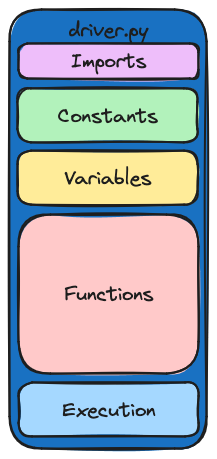

# FixMorph Driver Files

##### Table of Contents
- [Purpose](#purpose)
- [Organization](#organization)
- [General Workflow](#general-workflow)
- [Imports](#imports)
- [Definitions](#definitions)
- [Variables](#variables)
- [Functions](#functions)
- [Execution](#execution)
- [Modifying the Driver](#modifying-the-driver)
- [Running the Driver](#running-the-driver)

## Purpose
The driver file's role is to streamline the process of deploying FixMorph on a curated collection of example commits. These example commits are meticulously chosen and include specific commit hashes that represent various stages: upstream pre-modification, upstream post-modification, and downstream pre-modification. Additionally, they include manually crafted patches. These elements are integral in assessing and comparing the efficacy of solutions generated by FixMorph. This setup ensures a thorough and systematic evaluation of FixMorph's capabilities in handling diverse commit scenarios.

## Organization
The driver file is organized into five sections: 

- **Imports** - contains the imports used by the driver.
- **Definitions** - contains the definitions of the temporary directories used by the driver.
- **Variables** - contains the variables used as parameters for the FixMorph algorithm
- **Functions** - contains the functions used to run the FixMorph algorithm
- **Execution** - handles command-line args and starts the run function



## General Workflow
The general workflow of the driver is as follows:

1. Initialize variables required for run command
2. Parse command-line arguments and update configuration variables
3. Clone the repository
4. Create temporary directories
5. Run the FixMorph algorithm
6. Analyze the results

## Imports
The driver file imports the following packages:
- **os** - used to create temporary directories and run shell commands
- **sys** - used to parse command-line arguments
- **shutil** - used to copy files and directories
- **subprocess** - used to run shell commands
- **json** - used to parse JSON files
- **git** - used to clone repositories

## Definitions
The driver file defines many constants that are used to initialize temporary directories. Below is a list of some of the constants defined in the driver file:
- **CONF_DATA_PATH**
- **CONF_TOOL_PATH**
- **REPO_PATH**

## Variables
The driver file defines many variables that are used as parameters for the FixMorph algorithm. Below is a list of some of the variables defined in the driver file:
- **CONF_TOOL_NAME**
- **CONF_DEBUG**
- **CONF_ONLY_SETUP**

## Functions
The following functions are found in the driver file:

| Function Name       | Description |
|---------------------|-------------|
| **create_directories** | Creates the temporary directories used by the driver |
| **copy_file**          | Copies a file from one directory to another |
| **execute_command**    | Executes a shell command |
| **setup_each**         | Sets up each individual experiment, including checking out specific commits. | 
| **check_word_exist**   | Checks if a specific word exists in a file | 
| **analyse_result**     | Analyzes the result of an experiment by checking for specific keywords in a log file. |
| **write_as_json**      | Writes data to a JSON file |
| **evaluate**           | Runs an evaluation command for a tool, captures its output, and organizes it. |
| **clone_repo**         | Clones a repository |
| **write_conf_file**    | Writes a configuration file |
| **load_experiment**    | Reads and processes command-line arguments passed to the driver |
| **run**                | The main function that drives the entire experiment process. It reads arguments, clones repositories, loads experiments, creates directories, sets up each experiment, evaluates them, and analyzes the results. |


## Execution
The driver file is executed by running the following command:
```if __name__ == "__main__":
import sys
try:
    run(sys.argv[1:])
except KeyboardInterrupt as e:
    print("[DRIVER] Program Interrupted by User")
    exit()
```

## Modifying the Driver
The driver file can be modified to run FixMorph on a different repository. The following items need to be modified to run FixMorph on a different repository:
- **REPO_URL** - change the URL of the repository to be cloned
- **REPO_PATH** - not necessary to change, but can be changed to match the cloned repository
- **main-data.json** - change the contents of this file to match the repository to be cloned. This will require you to find examples of completed workflows in which a change to the upstream was backported to the downstream.

## Running the Driver
For an indepth explanation on how to run the driver, reference the steps in the experiment README to run the driver file. Below is a summary of the steps:
1. ### build docker image for FixMorph
```bash
cd /FixMorph/experiments/ISSTA21
docker build -t rshariffdeen/fixmorph:issta21 .
```

2. ### run docker container
```bash
docker run --name FixMorph -it rshariffdeen/fixmorph:issta21 bash
```

3. ### run driver file
```bash
python3.7 driver.py --data=[cve-data.json/main-data.json]
```